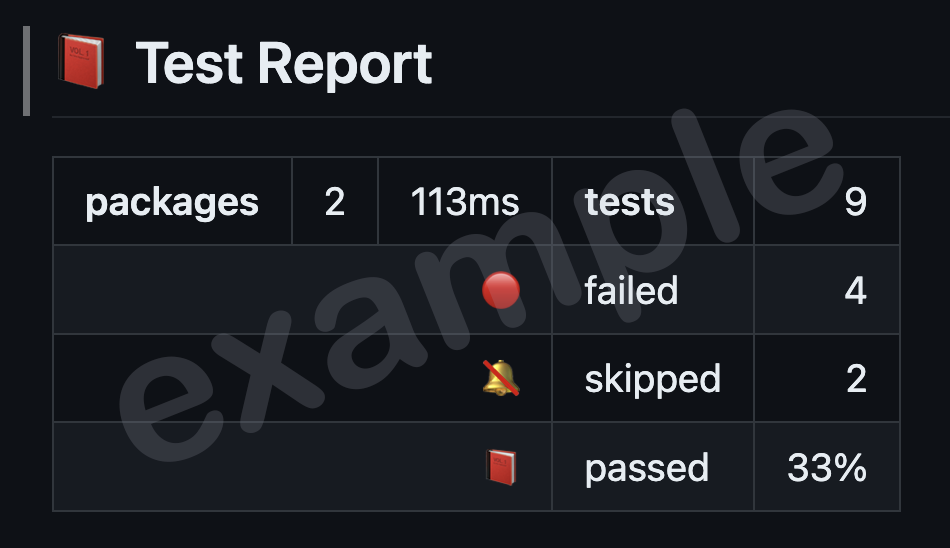
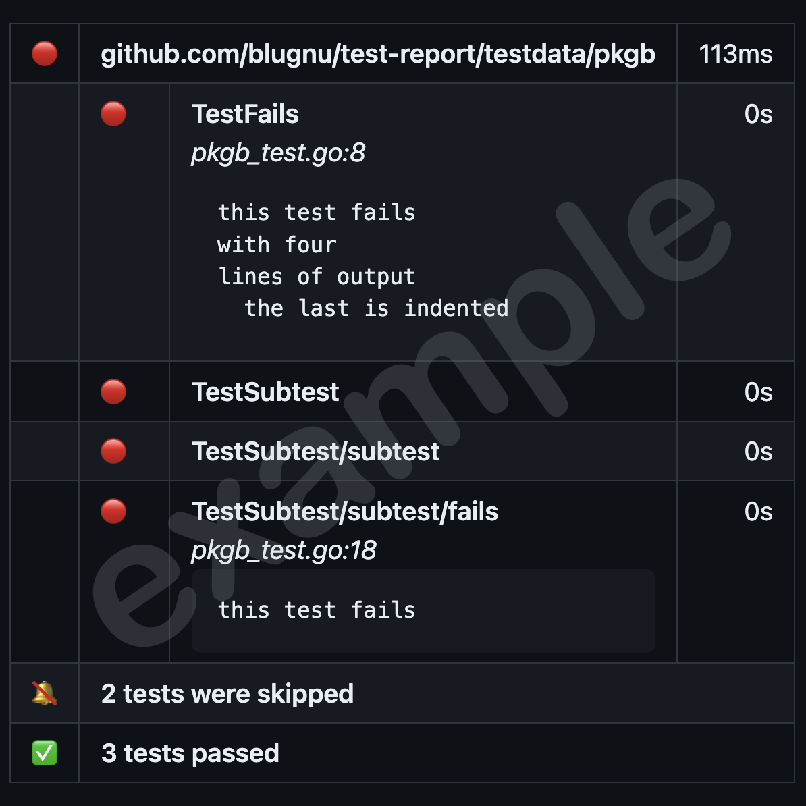

<div align="center" style="margin-bottom:20px">
  
  <h1>transform go test JSON output into markdown</h1>
  <div class='chipstrip'>
    <a href="https://github.com/blugnu/test-report/actions/workflows/pipeline.yml">
      
    </a>
    <a href="https://goreportcard.com/report/github.com/blugnu/test-report" >
        
    </a>
    <a>
      = 1.18" src="https://img.shields.io/github/go-mod/go-version/blugnu/test-report?style=flat-square"/>
    </a>
    <a href="https://github.com/blugnu/test-report/blob/master/LICENSE">
      
    </a>
    <a href="https://coveralls.io/github/blugnu/test-report?branch=master">
      
    </a>
    <a href="https://pkg.go.dev/github.com/blugnu/test-report">
      
    </a>
  </div>
</div>

## Installation

To install:

```shell
$ go install github.com/blugnu/test-report/
```

This will download and build `test-report` placing a copy of the binary in your `$GOPATH/bin` folder.

> NOTE: _It is recommended to add `$GOPATH/bin` to your path_

## Building From Source

`test-report` is entirely self-contained and can be built using the standard `go build` command if desired:

```shell
$ cd <source>
$ go build .
```

Where `<source>` is the folder containing the `test-report` source code,

## Usage

To use `test-report` with the default settings simply pipe the output from `go test -json` to `test-report`:

```shell script
$ go test -json | test-report
```

Without additional options, `test-report` will output a `test-report.md` file in the location
from which it is executed:

```shell
test-report.md
```

## Output Format

The markdown output produced by `test-report` is [GFM](https://github.github.com/gfm/) compliant,
including minimal `<table>` elements to ensure compatibility with github action job summaries
whilst presenting information in a clear and appealing format.

## Options

Additional options are available via command-line parameters:

```text
Usage:
  test-report [command]
  test-report [options]

Available Commands:
  version     displays the version number of the test-report executable

Options:
  -f, --full                produce a full report containing both passed and failed tests
                            (by default only details of failed tests are shown)

  -o, --output <filename>   the output filename (default "test-report.md")

  -t, --title <string>      the title text shown in the test report (default "Test Report")

  -h, --help                help for test-report

  -v, --verbose             while processing, show the complete output from go test
```

The name of the output file can be changed by using the `-o` or `--output` option.
For example, the following command will change the output to _test-results.md_:

```bash
$ go test -json | test-report -o test-results.md
```

To change the title shown in the output file:

```bash
$ go test -json | test-report -t "Test Results"
```

## Understanding the Report

The report produced by `test-report` is a markdown file that contains a summary of the test
results. By default, in addition to the summary, the report includes details of any _failed_
tests; this can be changed to include _all_ tests using the `-f` or `--full` flag.

The report can be limited to the just summary, without any failed test details, by using
the `-s` or `-summary` option.

### Report Title

The report title includes an icon indicating the overall result of the test report.  The icon
is presented in a different color according to the pass rate of the tests in the report:

| icon | indicates |
| :--: | -- |
| :closed_book: | pass rate is < 85% |
| :orange_book: | pass rate is >= 85% and < 95% |
| :ledger: | pass rate is >= 95% and < 100% |
| :green_book: | pass rate is 100% |

> _these icons and the associated pass rate %ages are currently fixed_

### Report Summary Section

Following the report title, at the top of the report a summary section identifies:

- the number of packages
- the elapsed time for the complete test run
- the total number of tests
- the number of tests that failed (_if any_)
- the number of tests that skipped (_if any_)
- the percentage of tests that passed

An example of a summary section might look similar to this:



### Report Details Section

Following the summary, a details section identifies any failing tests.

> _By default this section is omitted if there were no failed tests.
To present complete details including skipped and passed tests, use the `-f` or `--full` option._

Each package containing at least one failed test is listed. For each failed test the following
information is presented:

- name of the test
- source reference (_file name and line number_) for the failed test
- the output of the test

When reporting only failed tests (the default) additional entries are included in the details report
repeating the number of tests that were skipped or passed (if any).

The report details section might appear similar to:



<hr>

## Background

This tool was created to satisfy a desire to incorporate a test report into github
action job summaries, for which the HTML produced by existing tools was not suitable.

Markdown seemed to offer a better fit for that use case, and so this tool was born.

## Roadmap

If `test-report` proves useful, additional features may be added in the future which may include
support for additional output formats.

Current top-of-mind future features include:

- [link the filename and line number reference in test output to the corresponding
  file in the repository](https://github.com/blugnu/test-report/issues/1)

If any of these would be of particular interested, consider giving the relevant issue a :+1:

## Contribute & Support

- Add a GitHub Star :smile:
- Please consider [creating an issue](https://github.com/blugnu/test-report/issues) for any
  improvements you would like to see or any bugs you may find
- If you would like to contribute, please submit a pull request
